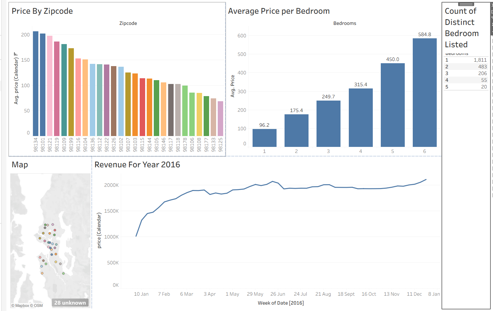

# 🏡 Airbnb 2016 Data Analysis Dashboard

> An interactive Tableau dashboard exploring Airbnb listing trends, pricing patterns, and availability across locations — powered by a Kaggle dataset and prepared with Python.

---

## 📁 Project Structure

```
📦 Tableau Project
 ┣ 📂 data/                        # Raw and processed dataset files
 ┣ 📄 airbnb_dashboard.twb         # Tableau workbook (main dashboard)
 ┣ 📄 dashboard.png                # Dashboard preview screenshot
 ┗ 📄 README.md
```

---

## 📊 Dashboard Preview



> *Open `airbnb_dashboard.twb` in Tableau Desktop to interact with the full dashboard.*

---

## 🗂️ Dataset

**Source:** [Airbnb Listings 2016 Dataset — Kaggle](https://www.kaggle.com/datasets/alexanderfreberg/airbnb-listings-2016-dataset)

Download the dataset programmatically using the Kaggle API:

```python
import kagglehub

# Download latest version
path = kagglehub.dataset_download("alexanderfreberg/airbnb-listings-2016-dataset")

print("Path to dataset files:", path)
```

---

## 🐍 Python — Data Preparation

Python was used to:

- Download the dataset from Kaggle via `kagglehub`
- Perform initial data exploration and sanity checks
- Prepare and clean data for ingestion into Tableau

---

## 🔍 Key Insights

The dashboard covers the following analytical areas:

| Area | Description |
|------|-------------|
| **Price Distribution** | How listing prices vary across regions and neighborhoods |
| **Listings by Zipcode** | Geographic concentration of Airbnb supply |
| **Room Type Analysis** | Breakdown of entire homes, private rooms, and shared spaces |
| **Availability Trends** | Seasonal and weekly availability patterns across listings |

---

## 🚀 Getting Started

1. **Clone or download** this repository
2. **Download the dataset** using the Python snippet above and place files in the `data/` folder
3. **Open Tableau Desktop** and load `airbnb_dashboard.twb`
4. **Explore** the interactive filters, maps, and charts

---

## 🧠 Skills Demonstrated

- **Data Visualization** — Tableau dashboard design with filters, charts, and maps
- **Data Analysis** — Identifying trends in pricing, supply, and availability
- **Python Integration** — Automating dataset acquisition and preparation

---

## 📌 Notes

- The dataset reflects Airbnb listings data from **2016** and is intended for analytical and learning purposes only.
- Tableau Desktop (free trial or full license) is required to open `.twb` files.

---

*Built as a portfolio project to demonstrate end-to-end data analysis and visualization skills.*
